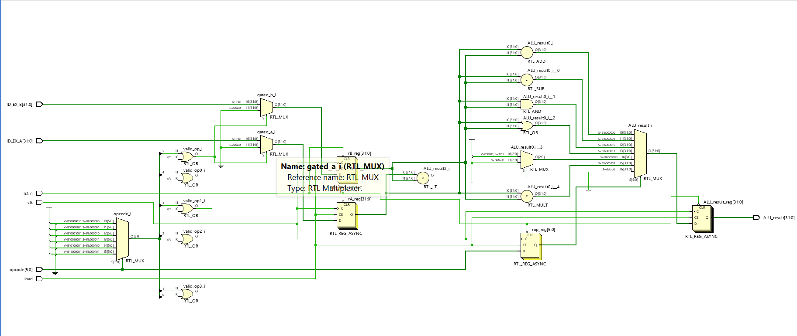
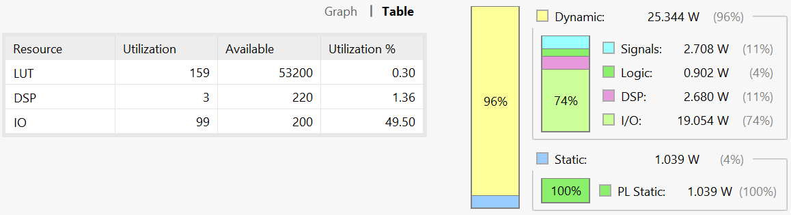
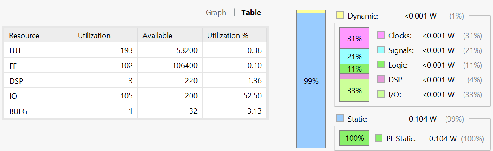
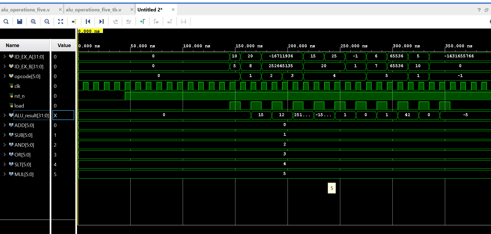

# ALU Optimization Experiment

This project began as a quick experiment to explore whether the ALU used in a RISC-V/MIPS processor could be optimized for power and resource utilization. The result was a redesigned ALU architecture that incorporates operation gating to reduce unnecessary switching activity and improve efficiency.

## Project Description

This repository implements a 32-bit signed Arithmetic Logic Unit (ALU) in Verilog. It supports basic arithmetic and logical operations and includes multiple architectural variants to explore power optimization techniques such as operation gating and input isolation.

## Overview

The ALU accepts two signed 32-bit operands and a 6-bit opcode to perform one of the following operations:

| Operation | Opcode (6-bit) | Description               |
|-----------|----------------|---------------------------|
| ADD       | `000000`       | Signed addition           |
| SUB       | `000001`       | Signed subtraction        |
| AND       | `000010`       | Bitwise AND               |
| OR        | `000011`       | Bitwise OR                |
| SLT       | `000100`       | Set if less than (signed) |
| MUL       | `000101`       | Signed multiplication     |

The design is synchronous, using a clock and active-low reset. Input sampling and result computation are gated using a `load` signal to reduce unnecessary switching activity and allow for controlled evaluation.

## Operation Gating

Operation gating refers to the technique of selectively activating only the logic required for the current operation, based on the opcode. Instead of allowing all functional blocks (e.g., adder, multiplier, comparator) to evaluate every cycle, only the relevant block is activated. This reduces dynamic power consumption by minimizing unnecessary toggling in unused logic paths.

## Schematic Design

The following schematic illustrates the gated ALU architecture, where only the selected operation block is activated based on the opcode:

## Power and Utilization Results

The modules were benchmarked on Vivado 2020.2.

**Baseline ALU**

*Figure: Power analysis of the baseline ALU design.*

**Optimised ALU**

*Figure: Power analysis of the optimised ALU with gated operand inputs.*

## Note

An experiment which started as a curiosity will be expanded and integrated into a broader processor pipeline optimized for energy efficiency.

## Output Waveform

The waveform below was captured post-implementation using Vivado simulation. It shows the ALU responding to various opcodes with correct results and gated evaluation:

The difference observed was a one clock cycle delay between input and output.