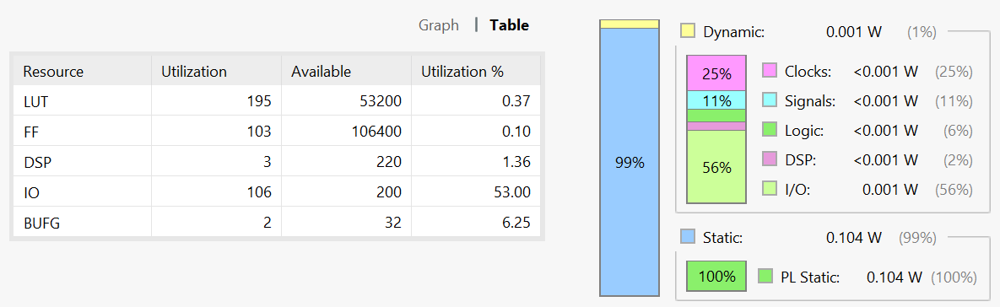
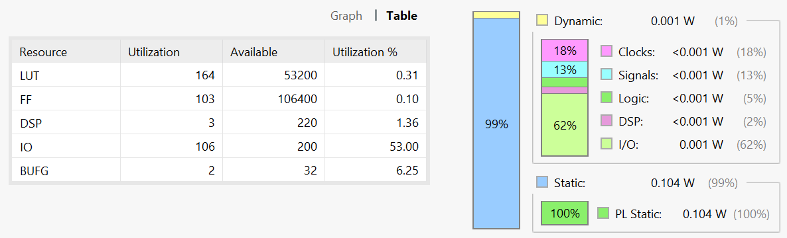
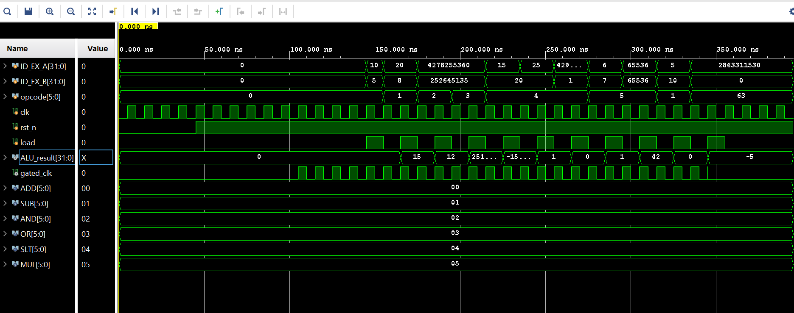

# ALU Optimization Experiment

This project began as a quick experiment to explore whether the ALU used in a RISC-V/MIPS processor could be optimized for power and resource utilization. The result was a redesigned ALU architecture that incorporates operation gating to reduce unnecessary switching activity and improve efficiency.

## Project Description

This repository implements a 32-bit signed Arithmetic Logic Unit (ALU) in Verilog. It supports basic arithmetic and logical operations and includes multiple architectural variants to explore power optimization techniques such as operation gating and input isolation.

## Overview

The ALU accepts two signed 32-bit operands and a 6-bit opcode to perform one of the following operations:

| Operation | Opcode (6-bit) | Description               |
|-----------|----------------|---------------------------|
| ADD       | `000000`       | Signed addition           |
| SUB       | `000001`       | Signed subtraction        |
| AND       | `000010`       | Bitwise AND               |
| OR        | `000011`       | Bitwise OR                |
| SLT       | `000100`       | Set if less than (signed) |
| MUL       | `000101`       | Signed multiplication     |

The design is synchronous, using a clock and active-low reset. Input sampling and result computation are gated using a `load` signal to reduce unnecessary switching activity and allow for controlled evaluation.

## Operation Gating

Operation gating refers to the technique of selectively activating only the logic required for the current operation, based on the opcode. Instead of allowing all functional blocks (e.g., adder, multiplier, comparator) to evaluate every cycle, only the relevant block is activated. This reduces dynamic power consumption by minimizing unnecessary toggling in unused logic paths.

## Schematic Design

The following schematic illustrates the gated ALU architecture, where only the selected operation block is activated based on the opcode:

## Power and Utilization Results

The modules were benchmarked using Vivado 2020.2 across four architectural variants:

### 1. Baseline ALU
- All operations are evaluated every cycle.
- No operand isolation or clock gating.
- Total power: 0.105 W

*Figure: Power analysis of the baseline ALU design.*

### 2. Operand Isolation
- Inputs to inactive operations are masked.
- Reduces toggling in unused logic paths.
- Total power: 0.105 W (no change in overall power, but internal signal activity reduced)

*Figure: Power analysis of the ALU with operand isolation.*

### 3. Clock Gating + Operation Isolation
- Registers and logic are updated only when `load` is asserted.
- Clock-related power reduced by 6%.
- Signal and DSP power decreased.
- IO power increased, maintaining total power at 0.105 W

*Figure: Power analysis of the ALU with clock gating enabled.*

### 4. Clock Gating + One-Hot Encoding
- Opcode decoding uses one-hot representation.
- Clock power reduced by 7% compared to clock gating alone.
- Signal power increased by 2%.
- IO power increased to 62%.
- Total power increased to 0.106 W

*Figure: Power analysis of the ALU with both clock gating and one-hot opcode encoding.*

These results highlight the trade-offs between internal power savings and IO behavior. While clock gating and operand isolation reduce dynamic switching internally, encoding strategies and IO toggling can influence overall power in unexpected ways.

## Output Waveform

The following waveforms were captured post-implementation using Vivado simulation.

**Standard ALU Operation**

*Figure: ALU responding to various opcodes with correct results. A one clock cycle delay is observed between input and output.*

**Clock-Gated ALU Operation**

*Figure: ALU with clock gating enabled. The internal clock only oscillates when a valid operation is triggered, reducing unnecessary switching.*

## Note

An experiment which started as a curiosity will be expanded and integrated into a broader processor pipeline optimized for energy efficiency.
